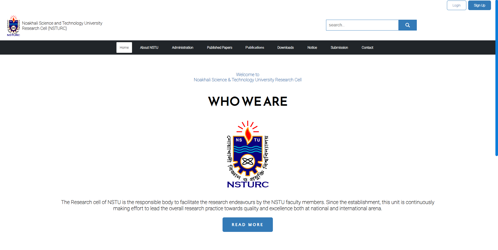

# NSTURC - Research Cell Portal

## Overview

**NSTURC (Noakhali Science and Technology University Research Cell)** is a digital platform designed to facilitate research activities at Noakhali Science and Technology University (NSTU). This platform provides an accessible and centralized repository for researchers and faculty members to publish, store, and share their research work.

The portal aims to streamline the submission, review, and publication process of research papers. It supports both established and emerging researchers, ensuring a robust and user-friendly environment for academic knowledge sharing.

## Features

- **Research Paper Repository**: A comprehensive collection of research papers from NSTU faculty members, regularly updated to showcase ongoing research activities.
- **Paper Submission**: Authors can submit their research papers directly through the portal for review and publication.
- **Administrative Review**: Submitted papers undergo an administrative review process to ensure quality and relevance before publication.
- **Publication Access**: Accepted and reviewed papers are made publicly available through the portal for further reference by students, researchers, and other academic professionals.

## Who We Are

The NSTURC research cell is the central body at NSTU responsible for facilitating the research activities of the university's faculty. Since its establishment, the cell has been instrumental in advancing the quality and accessibility of research outputs, both nationally and internationally.

The primary mission of NSTURC is to lead the research practice at NSTU towards greater excellence, encouraging high-quality research contributions and fostering collaboration within and outside the university.

## How to Submit a Paper

1. Navigate to the [NSTURC Website](index.html).
2. Sign up or log in to your account.
3. Access the "Submission" section from the main menu.
4. Fill out the necessary details regarding your paper.
5. Upload the research paper document for review.
6. Once submitted, the paper will be reviewed by the NSTURC admin team.
7. Upon approval, the paper will be made publicly visible on the portal.

## Publication Process

- **Submission**: Authors can submit their papers through the website's "Submission" feature.
- **Review**: The submitted papers are reviewed by the NSTURC administrative team to ensure the quality and relevance of the research.
- **Publication**: After successful review, the papers are published and made visible in the research repository.

## Contact Information

For any inquiries regarding paper submissions or the platform, please contact NSTURC through the [Contact Page](pages/contact.html).
